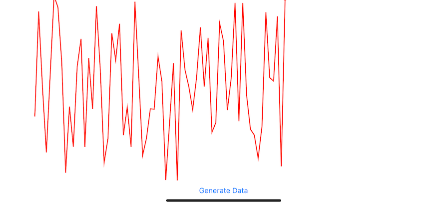

# ECGChart

ECGChart is a Swift and SwiftUI-based mobile application designed to simulate ECG-like charts. It provides a realistic representation of vital signs monitoring offering a visually appealing and interactive experience for user in medical field.

## Features

- **Realistic ECG Simulation:** Simulate electrocardiogram (ECG) charts with lifelike appearance.
- **Smooth Animations:** Utilize SwiftUI animations for a seamless and engaging user experience.

## Screenshots



## Getting Started

To run ECGChart on your local machine, follow these steps:

1. **Clone the repository:**

   ```bash
   git clone https://github.com/sirdarvs/ECGChart.git
2. **Open the project in Xcode:**
- Navigate to the project directory:
   ```bash
   cd ecg-chart
- Open the Xcode project file:
   ```bash
   open ECGChart.xcodeproj

3. **Build and run the application:**
- Choose a simulator or connect a physical device to your Mac.
- Press the "Run" button in Xcode or use the shortcut Cmd + R.
  
4. **Explore ECGChart:**
  
- Once the application is running, interact with the ECG-like chart.

## Dependencies

None (Pure Swift/SwiftUI project).

## Contributing

Contributions are welcome! Feel free to open issues or submit pull requests to enhance ECGChart.
